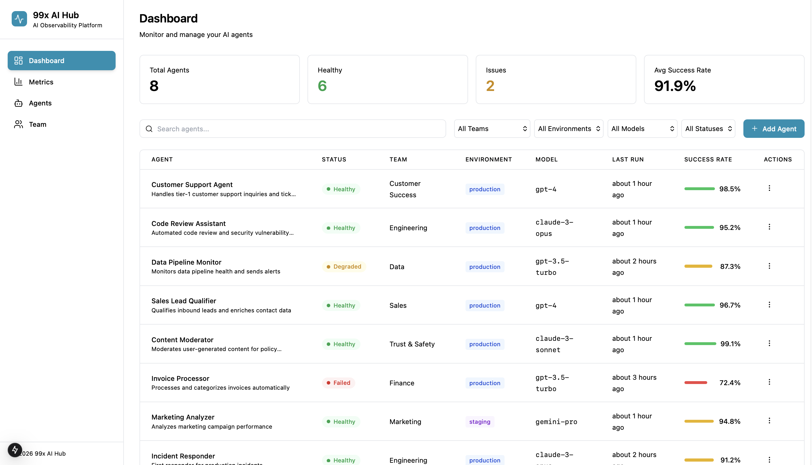

# 99X AI Hub - Next.js Dashboard



A modern, responsive dashboard application for AI agent management built with Next.js, featuring a beautiful Nordic-inspired UI design with teal accents. This project provides a comprehensive interface for managing agents, monitoring metrics, and team collaboration.

## 🚀 Features

- **Agent Management**: View and manage AI agents with detailed information
- **Metrics Dashboard**: Real-time monitoring and analytics with interactive charts
- **Team Collaboration**: User management and team insights
- **Responsive Design**: Modern UI with Nordic color palette and teal accents
- **TypeScript Support**: Full type safety throughout the application
- **Component Library**: Built with Radix UI and Tailwind CSS
- **Dark Mode Support**: Theme switching capability

## 🛠️ Tech Stack

- **Framework**: Next.js 15.1.6 (App Router)
- **Language**: TypeScript
- **Styling**: Tailwind CSS 3.4.0
- **UI Components**: Radix UI
- **Charts**: Recharts
- **Icons**: Lucide React
- **Theme**: Custom CSS variables with dark/light mode

## 📋 Prerequisites

Before you begin, ensure you have the following installed:

- **Node.js** (version 18.0 or higher)
- **npm** or **yarn** package manager
- **Git** for version control

You can check your versions with:
```bash
node --version
npm --version
```

## 🚀 Getting Started

### 1. Clone the Repository

```bash
git clone https://github.com/DisanduP/99X-AI-HUB-NEXTJS.git
cd 99X-AI-HUB-NEXTJS
```

### 2. Install Dependencies

```bash
npm install
```

This will install all the required dependencies including Next.js, React, TypeScript, Tailwind CSS, and other UI libraries.

### 3. Run the Development Server

```bash
npm run dev
```

Open [http://localhost:3000](http://localhost:3000) in your browser to see the application.

### 4. Build for Production

```bash
npm run build
npm start
```

The application will be available at [http://localhost:3000](http://localhost:3000).

## 📁 Project Structure

```
├── src/
│   ├── app/                    # Next.js App Router directory
│   │   ├── layout.tsx         # Root layout
│   │   ├── page.tsx           # Home page
│   │   ├── globals.css        # Global styles
│   │   ├── agents/            # Agents management page
│   │   │   ├── page.tsx       # Agents list
│   │   │   └── [id]/          # Dynamic agent detail page
│   │   │       └── page.tsx
│   │   ├── components/        # Reusable UI components
│   │   │   ├── ui/           # Base UI components (buttons, inputs, etc.)
│   │   │   ├── Sidebar.tsx    # Navigation sidebar
│   │   │   ├── MetricCard.tsx # Metric display cards
│   │   │   └── ...
│   │   ├── metrics/           # Metrics dashboard page
│   │   │   └── page.tsx
│   │   ├── team/              # Team management page
│   │   │   └── page.tsx
│   │   └── data/             # Mock data and types
│   │       └── mockData.ts    # Sample data
│   ├── styles/               # Styling files
│   │   ├── fonts.css         # Font definitions
│   │   ├── index.css         # Main CSS file
│   │   ├── tailwind.css      # Tailwind CSS imports
│   │   └── theme.css         # Theme variables and colors
│   └── types.ts              # TypeScript type definitions
├── public/                   # Static assets
├── package.json              # Dependencies and scripts
├── tailwind.config.js        # Tailwind CSS configuration
├── tsconfig.json             # TypeScript configuration
├── next.config.js            # Next.js configuration
└── postcss.config.js         # PostCSS configuration
```

## 🎨 Customization

### Color Theme

The application uses a Nordic-inspired color palette with teal accents:
- **Primary**: Teal (#0891B2)
- **Background**: Light gray (#FAFBFC) / Dark (#111827)
- **Accent**: Light blue (#E0F2FE)

You can customize the theme by modifying the CSS variables in `src/styles/theme.css`.

### Adding New Pages

1. Create a new directory in `src/app/` with a `page.tsx` file
2. Add navigation links in `src/app/components/Sidebar.tsx`
3. Update any routing logic as needed

### UI Components

The project uses Radix UI primitives with Tailwind CSS. All components are located in `src/app/components/ui/` and can be customized or extended as needed.

## 📱 Available Scripts

- `npm run dev` - Start the development server
- `npm run build` - Build the application for production
- `npm run start` - Start the production server
- `npm run lint` - Run ESLint for code quality

## 🤝 Contributing

1. Fork the repository
2. Create a feature branch (`git checkout -b feature/amazing-feature`)
3. Commit your changes (`git commit -m 'Add some amazing feature'`)
4. Push to the branch (`git push origin feature/amazing-feature`)
5. Open a Pull Request

## 📄 License

This project is based on the original Figma design available at: https://www.figma.com/design/HrFcOfHssLG0RwpJT7W0IQ/Design-99x-Agent-Studio

## 🆘 Support

If you encounter any issues or have questions:

1. Check the [Issues](https://github.com/DisanduP/99X-AI-HUB-NEXTJS/issues) page
2. Create a new issue with detailed information about your problem
3. Include your Node.js version, npm version, and any error messages

---

**Happy coding! 🚀**
  